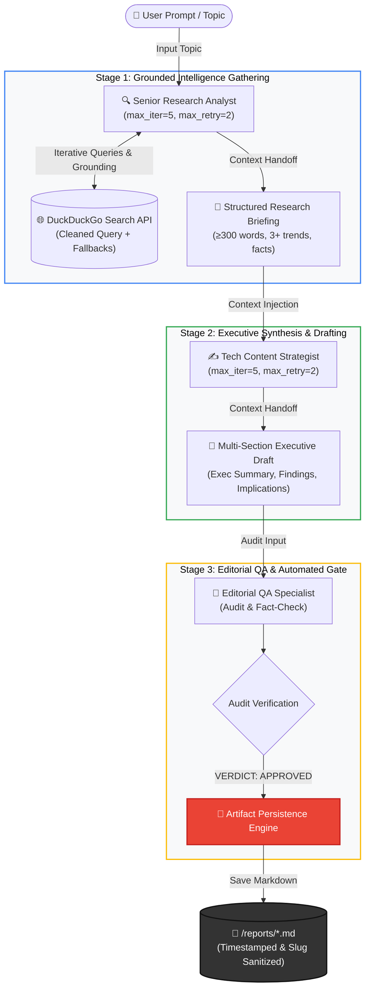
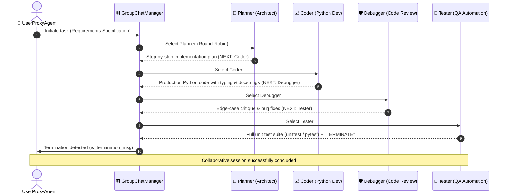

# 🤖 Multi-Agent Systems with CrewAI & AutoGen (Week 9)

<div align="center">

[](https://www.python.org/)
[](https://crewai.com)
[](https://microsoft.github.io/autogen/)
[](https://ai.google.dev/)
[](https://duckduckgo.com)
[](LICENSE)

<p align="center">
  <b>Autonomous Role-Based Sequential Crews & Conversational Multi-Agent Group Chats</b>
</p>

</div>

---

## 📌 Executive Overview

Week 9 explores the shift from single-agent ReAct and Plan-and-Execute architectures to **Multi-Agent Orchestration**. We implement, harden, and evaluate two production systems built on distinct multi-agent philosophies:

1. **CrewAI Research Team (`production_research_team.py`):** An assembly-line style, role-based sequential pipeline that conducts live web searches, synthesizes technical briefings, drafts executive reports, and applies a strict editorial QA gate with file persistence.
2. **AutoGen Coding Team (`coding_team.py`):** A conversational, shared-thread group chat where four specialized agents (Planner, Coder, Debugger, Tester) autonomously design, implement, review, and test production Python utilities.

---

## 🏗️ System Architectures

### 1. CrewAI Production Research Team (Sequential Assembly Line)



---

### 2. AutoGen Conversational Coding Team (Round-Robin Group Chat)



---

## ⚖️ Framework Comparison: CrewAI vs. AutoGen

| Dimension | CrewAI (`production_research_team.py`) | AutoGen (`coding_team.py`) |
| :--- | :--- | :--- |
| **Primary Philosophy** | **Role & Task Assembly Line** | **Conversational Shared-Thread Chat** |
| **Execution Topology** | Directed Acyclic Graph (`Process.sequential`) | Round-Robin / Dynamic Speaker Selection |
| **Agent Specialization** | Strict boundaries (No prompt pollution) | Collaborative peer discourse in shared context |
| **Task Contracts** | Explicit `expected_output` schemas | Emergent via prompt cues (`NEXT: ...`, `TERMINATE`) |
| **Termination Mechanism** | Stage-gate completion of final Task | `is_termination_msg` keyword interceptor |
| **Best Used For** | Multi-stage artifact generation & audits | Interactive code generation, debugging & refactoring |

### Why CrewAI for the Research Team
Research synthesis is an **assembly-line problem**. The workflow demands rigid stage gates: ungrounded queries must be filtered, factual signals extracted, executive rhetoric applied, and a line-by-line editorial audit executed before publishing. CrewAI's explicit abstractions (`Agent`, `Task`, `expected_output`, `Process.sequential`) prevent prompt compromise. The `Senior Research Analyst` focuses purely on factual grounding, while the `Tech Content Strategist` focuses exclusively on executive framing without worrying about search query formulation.

### Why AutoGen for the Coding Team
Software development is an **iterative dialogue problem**. Writing production code rarely succeeds in a one-pass waterfall; it thrives when multiple specialists observe the evolving codebase simultaneously. AutoGen's `GroupChat` allows the `Planner`, `Coder`, `Debugger`, and `Tester` to inspect the same conversational state, refining edge cases, verifying error handling, and generating unit tests collaboratively.

---

## 🚀 Getting Started & Execution Guide

### 1. Prerequisites & Installation

```bash
# Clone the repository
cd multi-agent-week9

# Create and activate virtual environment
python -m venv venv

# Windows (PowerShell)
.\venv\Scripts\activate

# Linux / macOS
source venv/bin/activate

# Install required dependencies
pip install crewai duckduckgo-search python-dotenv pyautogen==0.2.35
```

> [!IMPORTANT]
> **Dependency Pinning (`pyautogen==0.2.35`):**
> We explicitly pin `pyautogen==0.2.35` to avoid breaking changes and split namespaces introduced in the recent `ag2` / `autogen-agentchat v0.4+` ecosystem rewrite, ensuring stability with standard `GroupChat` and `UserProxyAgent` APIs.

### 2. Environment Configuration

Create a `.env` file in the root directory:
```env
GEMINI_API_KEY=your_google_gemini_api_key_here
# Or alternatively:
GOOGLE_API_KEY=your_google_gemini_api_key_here
```

---

### 3. Running the Projects

#### Running the CrewAI Research Team
```bash
python production_research_team.py
```
- Enter a topic interactively (e.g., *"Quantum Computing Fault Tolerance 2026"*), or hit **Enter** to run the default enterprise LLM adoption prompt.
- Progress, tool executions, and QA auditing will stream to the terminal.
- Deliverables are automatically saved to `reports/<slug>_<timestamp>.md`.

#### Running the AutoGen Coding Team
```bash
python coding_team.py
```
- The collaborative squad will initialize and execute the 4-phase architectural, implementation, review, and test pipeline, terminating cleanly upon test completion.

---

## 🧠 Architectural Synthesis: Multi-Agent vs. Single Agent

Across nine weeks of building agentic systems—from single **ReAct agents** (Weeks 3–4) and **Plan-and-Execute architectures** (Week 7) to **Multi-Agent Teams** (Week 9)—the decision of when to use multi-agent systems comes down to **domain complexity vs. orchestration overhead**.

Single agents (like ReAct or Plan-and-Execute) are the superior choice for deterministic, low-to-medium complexity tasks where a single system prompt can hold the full behavioral contract without cognitive degradation. A single agent executes faster, costs significantly fewer tokens, avoids inter-agent coordination deadlocks, and is vastly simpler to debug and monitor. 

Multi-agent architectures become necessary when a workflow requires **distinct conflicting personas, strict separation of concerns, or specialized toolsets that degrade a single prompt**. For example, a single prompt instructed to simultaneously conduct unbiased research, author persuasive prose, and ruthlessly audit its own claims will inevitably suffer from self-confirmation bias. By decomposing the workflow into isolated agents with explicit contracts (e.g., Researcher $\to$ Writer $\to$ Reviewer), each LLM call is tightly bounded, context pollution is eliminated, and automated quality gates can enforce production standards before downstream delivery.

---

## 📑 Live Sample Deliverable

The following unedited report was generated autonomously by `production_research_team.py` and saved to `reports/will_ai_replace_junior_devs__risks__oppo_20260902_192112.md`:

```markdown
# Research Report: Will AI Replace Junior Devs? Risks: Opportunities & 2026 Outlook!

**Date Generated:** 2026-09-02 19:21:12
**Execution Time:** 71.91 seconds
**Total Words:** 868

---

### Editorial Quality Assurance Audit

**1. Factual Accuracy:**
The draft maintains high fidelity to the research briefing. It accurately captures the shift from "replacement" to "augmentation," the "seniorization" of entry-level roles, the transition from manual coding to system orchestration, and the bifurcation of the 2026 talent market into "prompt-dependent" and "AI-native" segments. All key trends and terminology from the briefing are correctly integrated.

**2. Structural Integrity:**
The draft follows the required structure, including an Executive Summary, Key Industry Findings, and a Conclusion (rebranded as "Strategic Implications for Leadership"). The tone is professional, authoritative, and aligned with the technical nature of the briefing.

**3. Word Count Verification:**
The draft contains approximately 680 words, comfortably exceeding the 400-word minimum requirement.

**4. Editorial Assessment:**
The writer has successfully expanded upon the briefing to provide actionable strategic advice for leadership, which adds value while remaining strictly within the factual parameters provided. The flow is logical, and the terminology is consistent with the source material.

***

### The Evolution of Junior Developer Roles: Navigating the AI-Augmented Engineering Landscape

**Executive Summary**

The prevailing narrative regarding the impact of Artificial Intelligence on the software engineering workforce is undergoing a critical pivot. We are moving away from the simplistic fear of "replacement" toward a more nuanced reality of "augmentation and role redefinition." As we approach 2026, the traditional apprentice model—historically defined by syntax proficiency and the manual production of boilerplate code—is being rapidly compressed by AI-driven productivity tools. 

For leadership, this transition represents both a challenge and a strategic opportunity. The value proposition of the junior developer is shifting from "code-writing capacity" to "architectural reasoning and system orchestration." Organizations that successfully adapt their hiring, onboarding, and mentorship frameworks to this new reality will gain a significant competitive advantage in velocity and system quality. Conversely, those that fail to evolve will face a widening skills gap, characterized by a workforce that is overly reliant on AI abstractions without the foundational rigor required to maintain complex, mission-critical systems.

**Key Industry Findings**

*   **The "Seniorization" of Entry-Level Expectations:** The barrier to entry for junior roles is rising in direct correlation with the adoption of AI-assisted development environments (e.g., GitHub Copilot, Cursor). Because these tools allow a single developer to achieve the output previously requiring a small team, the market is demanding "full-stack" capabilities earlier in a developer's career. The industry is effectively "seniorizing" entry-level expectations; we are no longer hiring for the ability to write code, but for the ability to manage the lifecycle of AI-generated output. The junior developer of 2026 must function as an "AI orchestrator," possessing the critical thinking skills to review, debug, and integrate LLM-generated code rather than merely authoring it from scratch.

*   **The Shift from Coding to System Architecture:** AI is successfully automating the "toil" of software engineering—unit testing, documentation, and basic API scaffolding. While this reduction in manual labor is a boon for productivity, it creates a structural risk: the potential loss of foundational knowledge. Junior developers who bypass the "drudge work" phase of their careers may fail to develop the deep, intuitive understanding of how systems function under the hood. However, this shift also presents an opportunity to accelerate professional development. By offloading repetitive tasks to AI, junior talent can engage with high-level system design and architectural patterns years earlier than in previous decades, provided that mentorship programs are redesigned to emphasize these conceptual skills.

*   **The 2026 Outlook: The Rise of the "AI-Native" Developer:** We anticipate a bifurcation in the junior talent market by 2026. The first segment will consist of "prompt-dependent" developers who lack the engineering rigor to troubleshoot when AI models hallucinate or produce suboptimal, insecure code. The second, more valuable segment will be the "AI-native" developer. These individuals will treat AI as a force multiplier, demonstrating high "AI-literacy." This literacy is defined by the ability to manage AI agents, perform rigorous code audits, and maintain stringent security standards within an AI-augmented codebase. Organizations will increasingly prioritize these candidates, as they represent the future of sustainable, high-velocity engineering.

**Strategic Implications for Leadership**

To navigate this evolution, leadership must move beyond legacy hiring and training models. First, **hiring criteria must be recalibrated.** We must prioritize candidates who demonstrate strong foundational computer science principles and critical reasoning, as these are the traits that allow a developer to validate AI output. Technical interviews should evolve to include "AI-assisted" problem solving, testing a candidate’s ability to audit and refine AI-generated solutions rather than just writing code in a vacuum.

Second, **mentorship must be modernized.** The traditional "shadowing" model is insufficient in an AI-augmented environment. Senior engineers must transition into roles as "architectural mentors," focusing on teaching juniors how to evaluate system trade-offs, security vulnerabilities, and the long-term maintainability of AI-generated code. 

Finally, **governance and quality assurance must be integrated into the developer workflow.** As the reliance on AI increases, the risk of technical debt and security flaws grows. Leadership must foster a culture where "AI-literacy" is a core competency, ensuring that every developer—regardless of tenure—understands that AI is a tool for cognitive leverage, not a substitute for human judgment. By embracing this shift, we can transform the junior developer role from a cost center into a high-leverage engine for innovation.

**VERDICT: APPROVED**
```

---

## 📂 Repository Structure

```text
multi-agent-week9/
├── README.md                      # Comprehensive project documentation & architecture graphs
├── journal.md                     # Daily engineering reflections (Days 1–5)
├── production_research_team.py    # Production 3-agent CrewAI pipeline with persistence & QA gate
├── coding_team.py                 # 4-agent AutoGen collaborative group chat coding system
├── hierarchical_team.py           # CrewAI hierarchical manager/delegation experiment
├── research_team.py               # Baseline 3-agent sequential research crew
├── hello_multiagent.py            # Minimal 2-agent proof of concept
└── reports/                       # Persisted research deliverables & editorial audit logs
    ├── will_ai_replace_junior_devs__risks__oppo_20260902_192112.md
    ├── automated_ai_code_review_and_cybersecuri_20260902_042233.md
    └── open_source_llms_vs_proprietary_models_e_20260902_042101.md
```

---

<div align="center">
  <sub>Part of the 10-Week Production-Grade AI Agent Program · Next: Week 10 (Production Concerns: Guardrails, Tracing, Monitoring, Latency, Cost & Caching)</sub>
</div>
